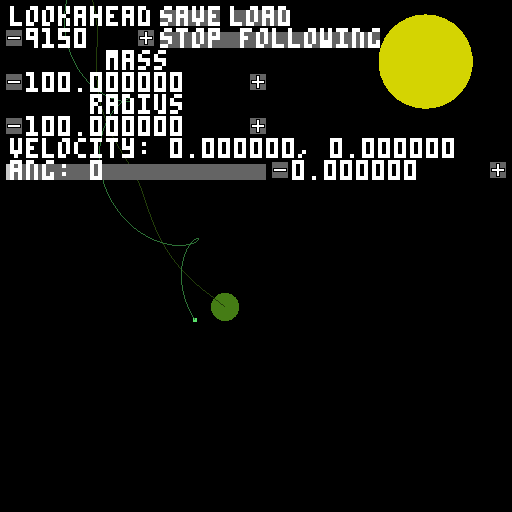
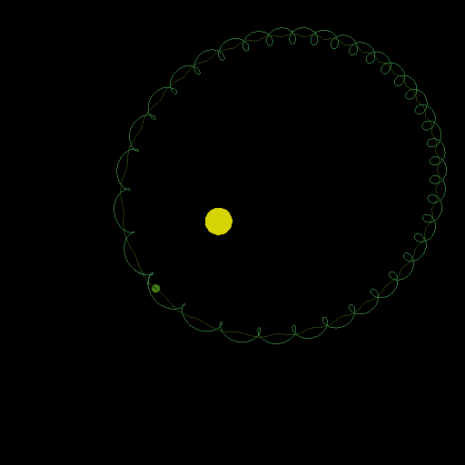
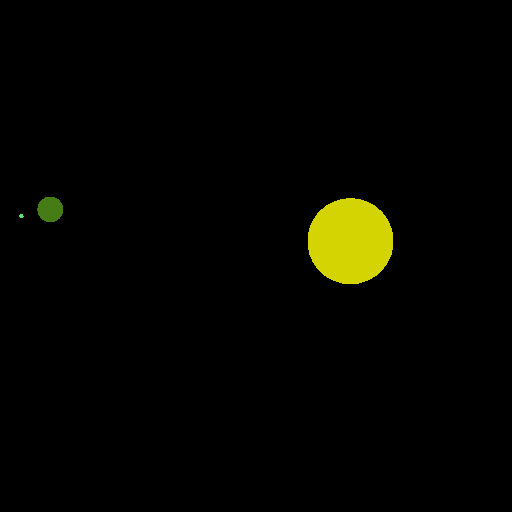

+++
date = '2025-07-21T17:46:29-04:00'
draft = false
title = 'Projects'
+++

## Low Level

### MC1 CPU

The first ISA I ever designed. This was used as the model for a minecraft redstone computer I made later.

[download](https://github.com/PegaFox/pegafox-mc1)

## Simulations

### Orbit simulator

A 2 dimensional playground where you can create astral bodies and let them spin and collide!

[download](https://github.com/PegaFox/solar-system-creator)

Executable downloads on the way!
